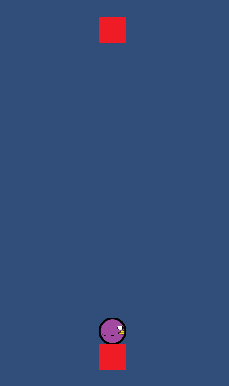
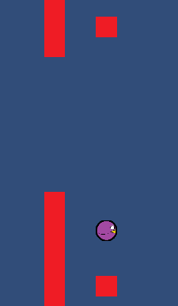

# Toy Unity Tutorial

Let's skip the pleasantries and get straight to business.

In this tutorial, you'll be recreating the [flappybirb example](https://github.com/Ratstail91/flappybirb). You'll need some sprites such as walls, a floor, a ceiling, and of course, your birb. I'm using these:


I'm using the red block image as a placeholder for everything but the birb.

First, I'm assuming you're familiar with Unity. If not, there are plenty of tutorials elsewhere that can teach you what I can't. I'm also going to assume you're familiar with the _concept_ of an embedded scripting language; that's Toy's role in Unity.

First, create a GameObject for the Birb, giving it a Rigidbody2D and a CircleCollider2D. Next, make a floor and ceiling below and above the Birb, and give them static Rigidbody2Ds and BoxCollider2Ds. Finally, make sure that the Birb falls to the floor due to gravity.



Next, create a prefab for the ~~pipes~~ moving walls, with a gap between them for the player to fly through. Make sure the collidable parts have BoxCollider2Ds and Rigidbody2Ds; you could make them children of an empty GameObject if needed.

Save it into a folder called "Prefabs".



Finally, tag anything that you'll collide with as "Wall", such as the floor, ceiling and moving walls (the child objects in the prefab would be tagged this way, not the parent).

Let's get Toy ready. Add a `ToyBehaviour` to The Birb object, and enter a file name (I'm using `Birb`). Then, create a folder called in Assets called "StreamingAssets" - this is a special Unity folder where Toy scripts need to live, so you can mod your games later (you can use subfolders if you specify them in the `ToyBehaviour`). Right click on StreamingAssets, go to the "Create" menu and select "Toy Script", and give it the same file name you entered above.

## Birb.toy

Now let's get into some code. Enter the following into `Birb`:

```
import "Unity";

this.Behaviour.Update = () => {
	if (Unity.GetButtonDown("Fire1")) {
		this.Rigidbody2D.AddForce(0, 10, "impulse");
	}
};

this.Behaviour.OnCollisionEnter2D = other => {
	if (other.Tag == "Wall") {
		Unity.TimeScale = 0; //pause the game on loss
	}
};
```

Let's step through this one line at a time. First, you need to `import "Unity";`, which imports the Unity plugin so you can access various parts of the engine.

Next, you'll see the `this` variable used, which is automatically declared by the `ToyBehaviour`, and refers to the GameObject that called the script. So, from `this`, you're accessing the Behaviour itself, and then setting the Update property to a equal a new function (in Toy, all functions are expressions rather than statements).

Update doesn't take any parameters, so leave the parameter list as `()` followed by the arrow operator (which is what really signifies a function). Finally, the function body is written between a pair of brackets, and ends with a semicolon (Always remember the semi-colon after writing a function - one of the wonderful quirks of Toy!)

Inside the function, we see some familiar looking code. We access `GetButtonDown` from `Unity` and check for the button registered as "Fire1" - by default this is the left mouse button. If this has been pressed, then we use `this` again, this time accessing `Rigidbody2D` (which we attached to the GameObject earlier) and call `AddForce`. This function takes three parameters: the X direction, the Y direction and the force mode as a string (valid force modes are `force` and `impulse`). In this case, we cause a single impulse upwards along the Y axis.

Now that we have our simple jump, lets add some collision behaviour. This time, we'll access the Behaviour's `OnCollisionEnter2D`. This time, the function takes one parameter, named `other` (in Toy, the parenthesis can be omitted if there is exactly one parameter. The braces can also be omitted if there is only an expression as the body, which returns the result of that expression). This time, we'll check the Tag of `other` and, if it's equal to `"Wall"`, then we'll set the `Unity.TimeScale` to 0, which will essentially pause the game. We'll use this to check for a game loss later.

## ScoreText.toy

Go back to the Unity scene, and add two TextMeshPro texts to a canvas - one named "Score Text" and the other named "Lose Text", and place them where they're visible. You can leave them both blank for now.

Attach a new `ToyBehaviour` to Score Text, and link it to a new file (like `ScoreText.toy`). Put the following into it:

```
import "Standard";
import "Globals";

Globals["score"] = 0;

this.Behaviour.Update = () => {
	this.TextMesh.SetText("Score: " + ToString( Globals["score"] ));
};
```

Here, we `import "Standard";`, which adds the basic standard functions. Then we `import "Globals";`, which is designed to get around some of Toy's shortcomings in Unity - specifically, sharing variables between different .toy files.

Next, we set a variable in Globals called "score" to 0. Then, we set Score Text's Update to a function, where we access it's TextMesh, and set it's value. You can see here that on every update, the contents of Score Text will be set to the value "score" stored in Globals, no matter where it's changed.

## WallController.toy

This file is a bit more complex - it handles spawning, despawning and moving the walls that the player has to avoid. As such, I'm actually going to present each piece one at a time. Create an empty game object called "WallController" and attach this script to it using a `ToyBehaviour`.

```
import "Standard" as std;
import "Math";
import "Array";
import "Dictionary";
import "Unity";
import "Globals";
```

First, we simply import as bunch of libraries and plugins. We see the familiar Globals at the bottom. Also note the first line, `import "Standard" as std;`. This is a feature of Toy called aliasing, where we can rename or store the contents of a library/plugin inside of another name. This is good for preventing name clashes in larger programs.

We've also imported Array and Dictionary, which come as standard as part of the Toy language, but are actually plugins. Math simply provides some Mathematical functions that we'll be using, and Unity is, well, Unity.

```
var loseText = Unity.FetchGameObject("Lose Text");

var spawnTimer = std.Clock();
var wallArray = Array();
```

Here, we declare some variables. First, we fetch the "Lose Text" GameObject (this uses Unity's find() function, so it's expensive - keep that in mind). Then we create `spawnTimer` which will simply track the last time a wall was spawned. Finally, we declare `wallArray`, which will contain our walls.

```
this.Behaviour.Update = () => {
	//handle game loss
	if (Unity.TimeScale == 0 && loseText.TextMesh.GetText().Length() == 0) {
		loseText.TextMesh.SetText("You Lost!!");
	}
};
```

Here, we set the text of `loseText` if the game is paused and it hasn't already been set.

```
this.Behaviour.FixedUpdate = () => {
	//spawn the walls on a timer
	if (std.Clock() - spawnTimer >= 5) {
		spawnWalls();
		spawnTimer = std.Clock();
	}

	handleWalls();
};
```

This is the heart of the game - spawning walls on a timer, and handling existing walls. First, we check to see if 5 seconds or more have passed. If so, we call `spawnWalls`, and update the spawn timer. Finally, we call `handleWalls`.

```
const spawnWalls = () => {
	var wall = Dictionary();

	var posY = Math.Floor(std.Random() * 6) - 3;

	wall["gameObject"] = Unity.LoadGameObjectAt("Prefabs/Wall", 12, posY, 0, 0, 0, 0);
	wall["spawnTime"] = std.Clock();
	wall["scored"] = false;

	wallArray.Push(wall);
};
```

`spawnWalls` can be stored as a constant, since we won't be changing this function. What it does is this:

* Create a new `Dictionary` instance
* Creates a random position along the Y axis using `Random` and `Math.Floor`
* Loads the "Wall" prefab at a specific point and stores it into the wall dictionary
* stores the wall's spawn time
* stores if we've scored from this wall or not
* Stores the filled wall dictionary into the wallArray

The third line will need a bit more explanation - Unity's `LoadGameObjectAt` takes a total of 7 arguments. These arguments are:

* Prefab file name
* X position
* Y Position
* Z Position
* X Rotation
* Y Rotation
* Z Rotation

The prefab name we pass in here refers to the wall prefab we created at the start. It loads the prefab at the correct position (with the X and Y positions offset), and returns the GameObject, which is immediately stored inside the Wall dictionary.

```
const handleWalls = () => {
	for (var i = 0; i < wallArray.Length(); i++) {
		//destroy old walls
		if (std.Clock() - wallArray[i]["spawnTime"] >= 10) {
			wallArray[i]["gameObject"].Destroy();
			wallArray.Delete(i);
			i--; //everything moves down one
		} else {
			wallArray[i]["gameObject"].Rigidbody2D.PositionX -= 0.05;
			if (wallArray[i]["gameObject"].Rigidbody2D.PositionX <= 0 && !wallArray[i]["scored"]) {
				wallArray[i]["scored"] = true;
				Globals["score"] = Globals["score"] + 1;
			}
		}
	}
};
```

OK, this one is dense, but it's the last one, promise!

First, we iterate over the `wallArray` using a classical `for` loop. If the current wall is 10 seconds old or older, then we destroy the GameObject, delete the element from the Array, and decrease the iterator counter as everything else in the array shifts down one when something is deleted - Arrays can't have holes!

If, however, the wall is not to old, then we increment the GameObject's X position via it's Rigidbody2D. Then, if this wall has passed the 0 position (where our Birb is) and we haven't scored off of this wall, then we set the pipe's scored status to true, and increment the Global score value by 1, thus causing the code in `ScoreText.toy` to update the on-screen score.

## Play Time!

Now, it's time to try the game out! How did you do? Did you miss something? Did I miss something? If I have, please leave an issue via [github's issue tracker](https://github.com/Ratstail91/Toy/issues), I really appreciate it!
